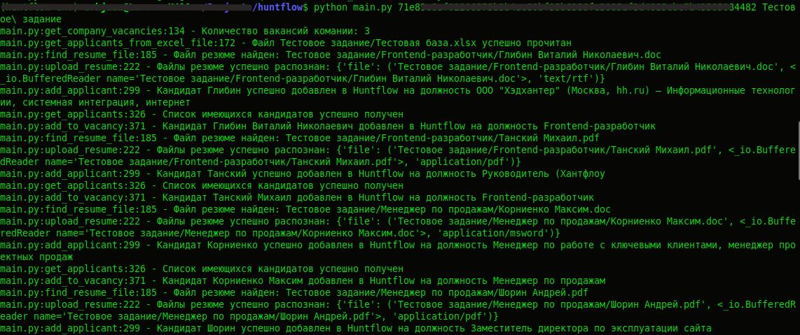

## Утилита для переноса базы кандидатов в Хантфлоу

Позволяет перенести базу кандидатов из файла Excel и файлов резюме в [Хантфлоу](https://huntflow.ru/), используя [Хантфлоу API](https://github.com/huntflow/api)

### Подготовка

Предполагается, что у Вас имется файл Excel с кандидатами со следующими столбцами:
```
Должность	ФИО		Ожидания по ЗП		Комментарий		Статус

Менджер		ФИО		200000				Любой текст		Отказ
```

Так же предполагается, что этот файл и файлы с резюме кандидатов находятся в одной директории (возможно, разделенные по субдиректориям).

### Установка

1. Клонировать репозиторий:
```
git clone https://github.com/ArkJzzz/hf_test_quest.git
```

2. Установить зависимости:
```
pip3 install -r requirements.txt
```

### Запуск
```
python3 main.py <token> <Имя_директории>
```



После этого указанные кандидаты появятся в [Хантфлоу](https://huntflow.ru/)